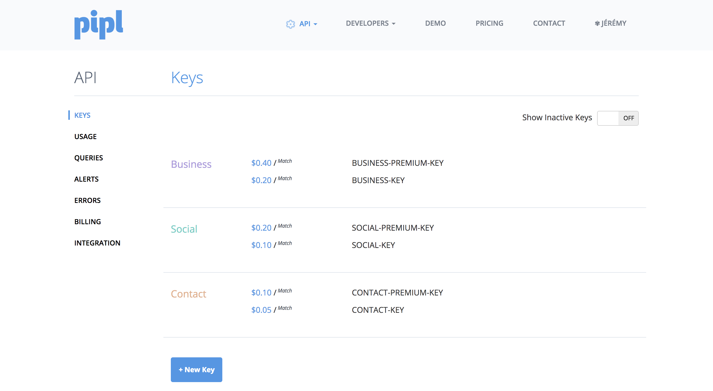

#  Pipl Connector

The Pipl Connector allows you to enrich customer profiles 

## Getting Started

Go to the Connectors page of your Hull organization, click the button “Add Connector” and click “Install” on the Pipl card.

## How to find your API key 

On Pipl website, click on `My Account`, then select `API` and choose `Show me my keys`:

—

Developed with 🍵 by growth@spendesk.com

